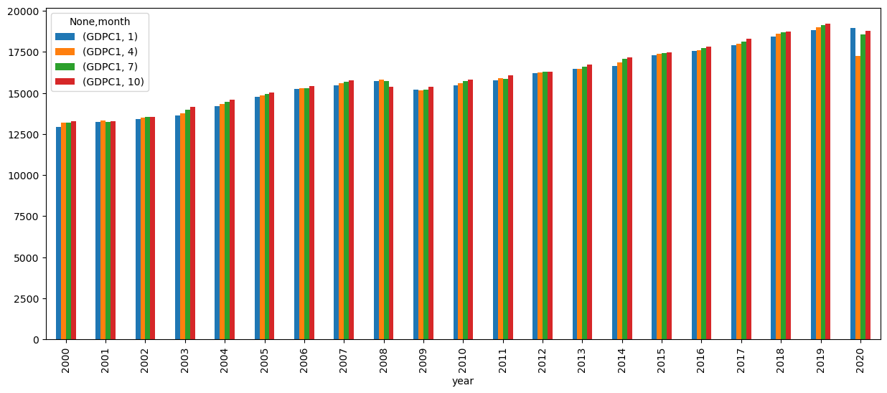
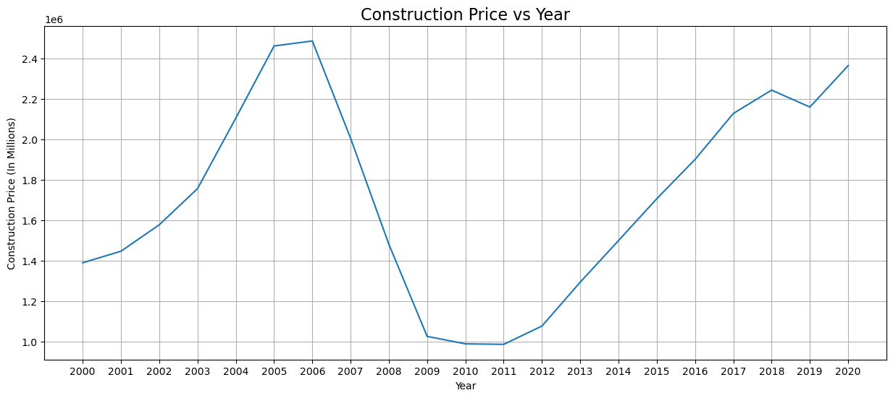
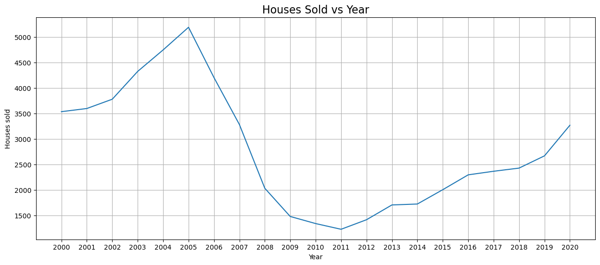
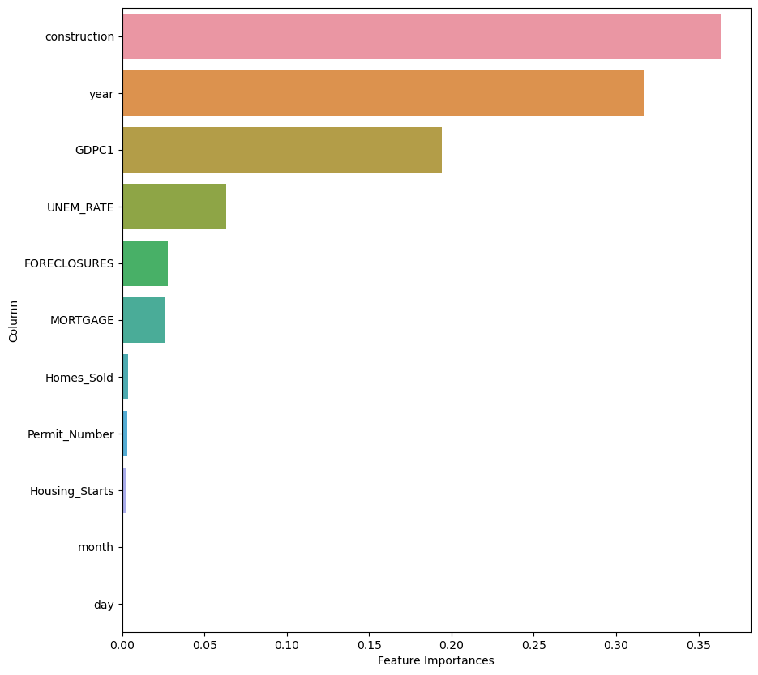

## Problem Statement
The Problem is relatively simple. Just analyze which parameters affect the HPI across US the most, and make viable solutions on how to tackle the problem with DS Life cycle.

## Data
Supply-Demand Datasets with 84 common datapoints is used for EDA and Data Modeling.

## Methods
Linear Regression, Random Forest Regressor and Gradient Boosting Regressor have been used to predict House Price Index in the United States.

## Results

### EDA

<b>Quarterly GDP is slowly increasing from the year 2000 to the year 2020</b>

As the HPI decreases from the year 2007 to the year 2012, the construction spending also decreases, and two independent variables, namely Homes Sold and Housing Starts also have a downward trend. Even though HPI is not at its peak, the construction spending hits its maximum in the year 2006 showing that inflation is present. In the year 2005, maximum number of housing projects have been started in the year 2005, and the highest number of homes have been sold in the same year meaning that HPI does not have a direct influence on these variables.

### Feature Importances

In the image above, the most important feature is the construction spending, followed by year, which is followed by quarterly GDP of the US.

## For more Information

Shoot an email at vinayak.modgil@gmail.com

## Repository Structure
├── data
├── images
├── README.md
└── factors-influencing-house-price-index
